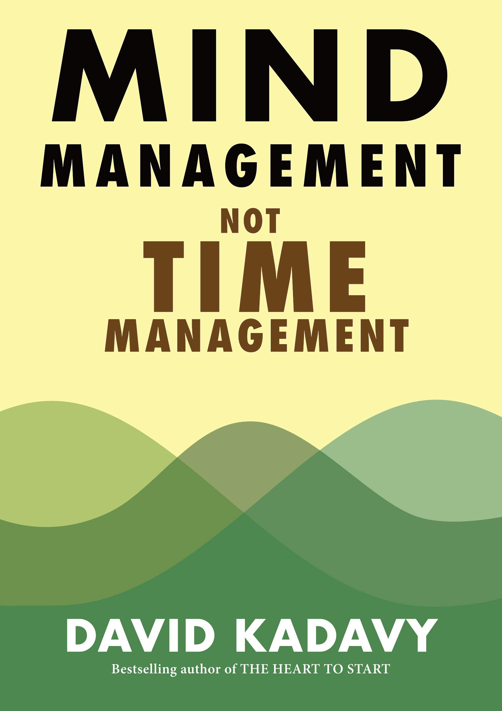

# Mind Management, Not Time Management: Productivity When Creativity Matters
- :man: __David Kadavy__ 
- :link: [Goodreads](https://www.goodreads.com/book/show/54938047-mind-management-not-time-management)
- :star: :star: :star: :star: 

## Notes and Hightlights
- [Chapter 1 - Mind Management, Not Time Management](../.github/images/mind_management-1.png?raw=true)
- [Chapter 2 - Creative Sweet Spot](../.github/images/mind_management-2.png?raw=true)
- [Chapter 3 - The Four Stages of Creativity](../.github/images/mind_management-3.png?raw=true)
- [Chapter 4 - The Seven Mental States of Creative Work](../.github/images/mind_management-4.png?raw=true)
- [Chapter 5 - Creative Cycles](../.github/images/mind_management-5.png?raw=true)
- [Chapter 6 - Creative Systems](../.github/images/mind_management-6.png?raw=true)
- [Chapter 7 - Creating in Chaos](../.github/images/mind_management-7.png?raw=true)

## Summary
- "To start managing your creative energy, start by rethinking time."
- "Find your Creative Sweet Spot."
- "When a creative problem gets tough, remember to respect the Four Stages of Creativity."
- "Build mastery in one mental state at a time."
- "Be mindful of the tools you use and the settings in which you do your work."
- "As you master Creative Cycles, you can start building Creative Systems."
- "Finally, build systems that not only withstand the chaos of life, but that improve from that chaos."